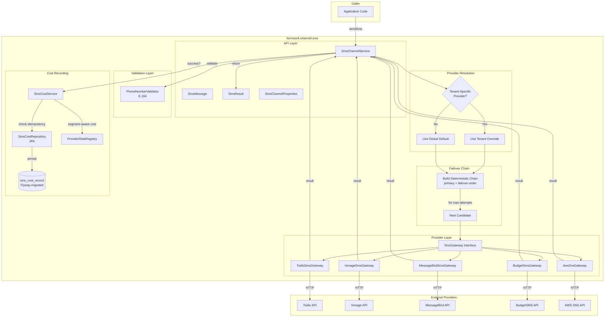
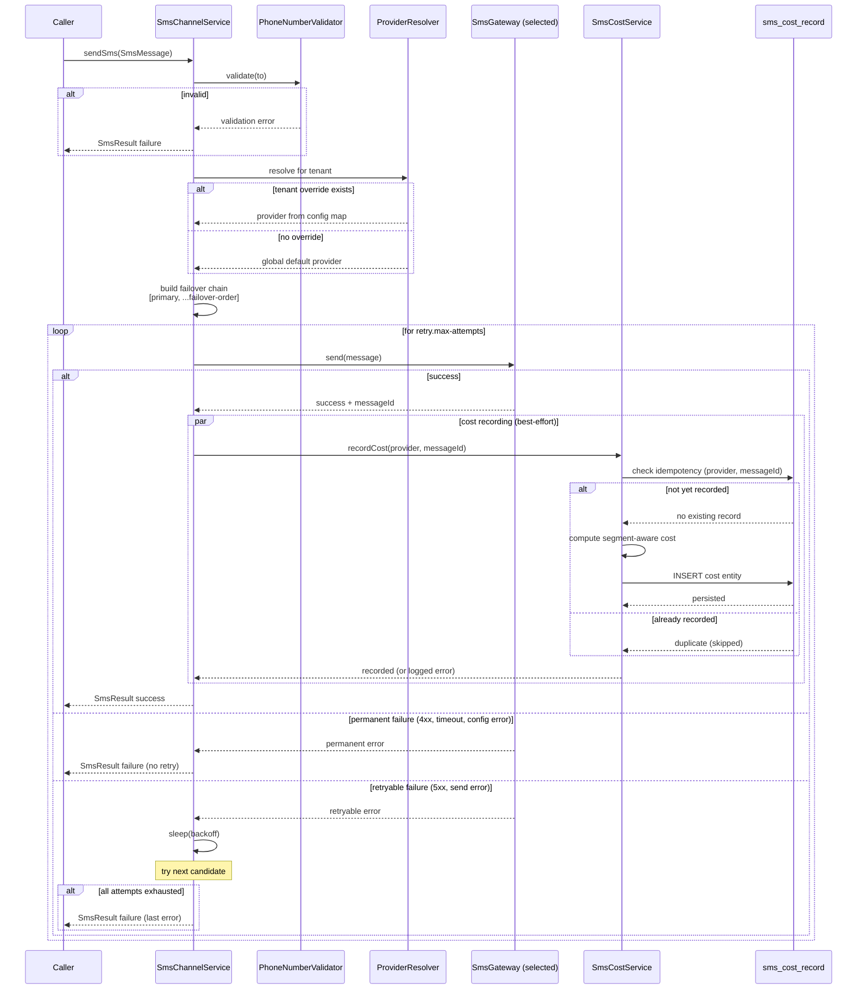
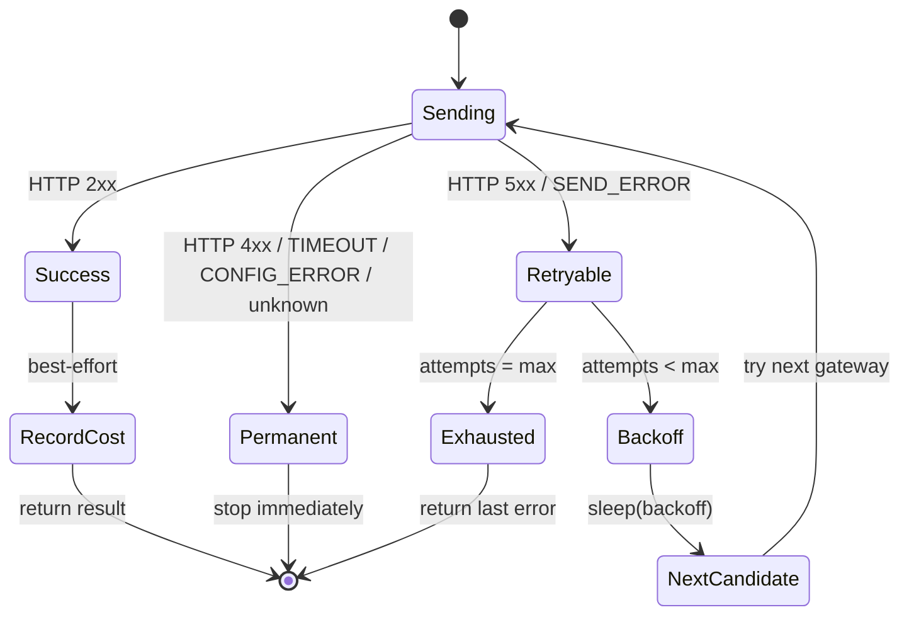
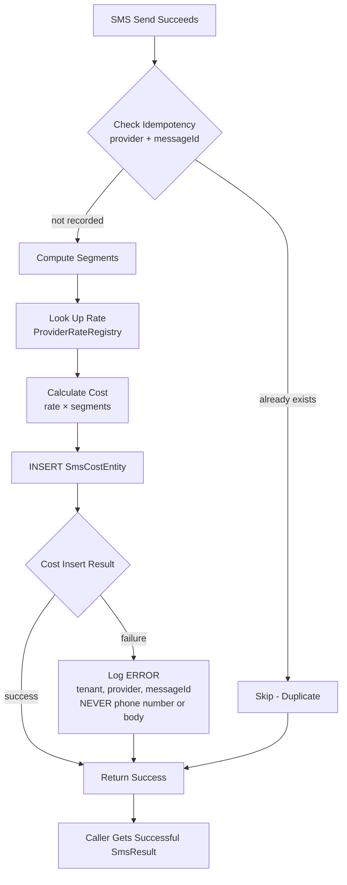
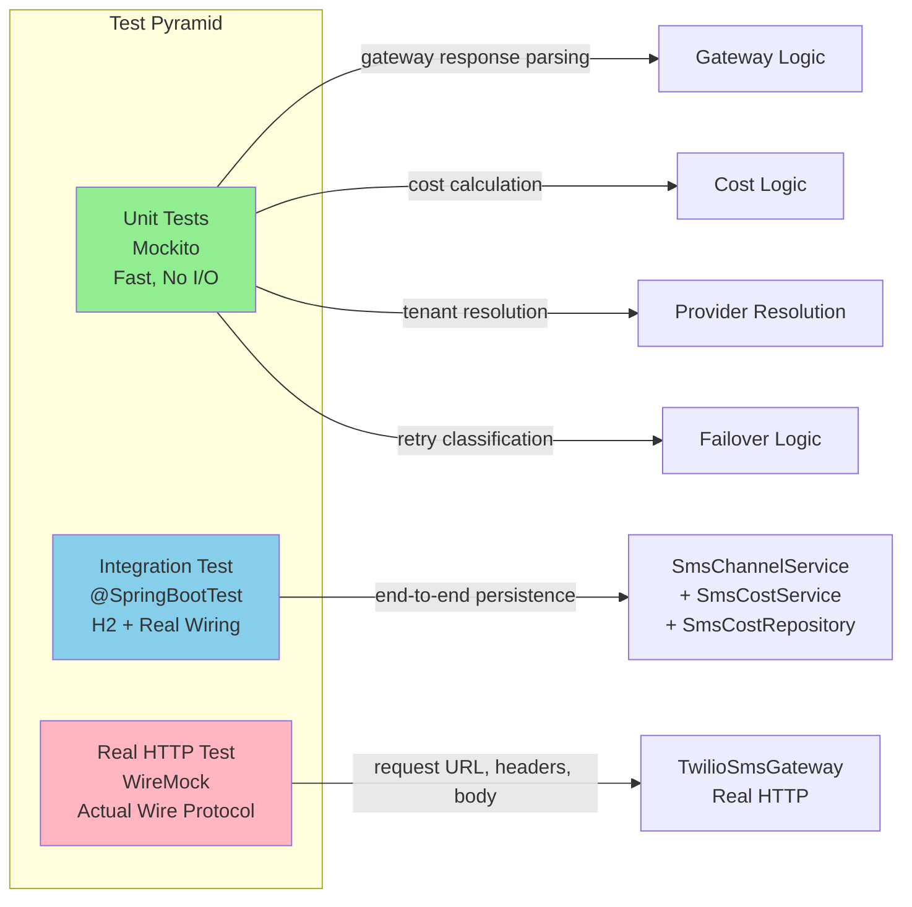
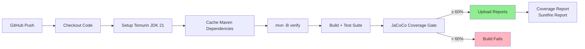
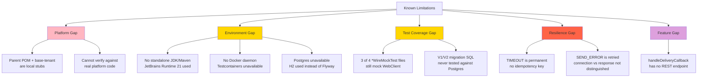
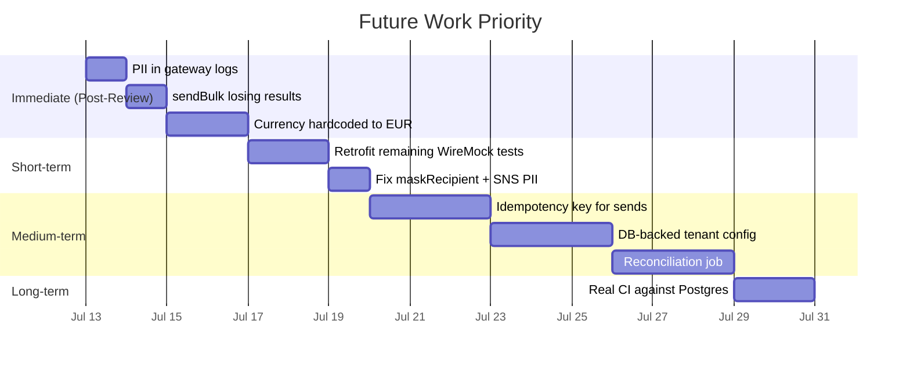

# formwork-channel-sms — production review

This is a hostile production review of `formwork-channel-sms`, a Spring Boot
SMS module from a multi-tenant platform, done as a take-home assignment (see
[ASSIGNMENT.md](ASSIGNMENT.md)). It sends SMS through five providers
(Twilio, Vonage, MessageBird, BudgetSMS, AWS SNS) behind a common
`SmsGateway` interface and records per-tenant cost.

Findings are in **[REVIEW.md](REVIEW.md)**. This file covers everything
else: how to build it, what changed and why, what's still missing, and what
I'd do next.

---

## Module purpose and architecture

```
formwork-channel-sms/
  api/         SmsChannelService (entry point), SmsMessage, SmsResult,
               SmsChannelProperties (config), SmsGateway (interface)
  provider/    One SmsGateway implementation per provider
               (Twilio, Vonage, MessageBird, BudgetSMS, AWS SNS)
  cost/        SmsCostEntity, SmsCostRepository, SmsCostService,
               ProviderRateRegistry - the billing/usage pipeline
  validation/  PhoneNumberValidator (E.164)
  config/      Spring Boot auto-configuration wiring the above
```

### Architecture overview



### Request flow sequence



### Domain model

```mermaid
classDiagram
    class SmsChannelService {
        +sendSms(SmsMessage) SmsResult
        +sendBulk(List~SmsMessage~) List~SmsResult~
        -resolveProvider(tenantId) SmsGateway
        -buildFailoverChain(primary) List~SmsGateway~
        -recordCostSafely(provider, messageId, message)
    }
    
    class SmsGateway {
        <<interface>>
        +send(SmsMessage) SmsResult
        +getProviderCode() String
    }
    
    class SmsMessage {
        +String to
        +String from
        +String body
        +Map~String,String~ metadata
    }
    
    class SmsResult {
        +boolean success
        +String messageId
        +String providerCode
        +SmsSendStatus status
        +String errorMessage
    }
    
    class SmsChannelProperties {
        +ProviderCode provider
        +Map~String,ProviderCode~ tenantProviders
        +List~ProviderCode~ failoverOrder
        +RetryConfig retry
        +TwilioConfig twilio
        +VonageConfig vonage
        +MessageBirdConfig messagebird
        +BudgetSmsConfig budgetsms
        +AwsSnsConfig awsSns
    }
    
    class SmsCostEntity {
        <<JPA Entity>>
        +UUID id
        +String tenantId
        +String provider
        +String messageId
        +BigDecimal cost
        +String currency
        +int segmentCount
        +Instant createdAt
    }
    
    class SmsCostService {
        +recordCost(provider, messageId, message) boolean
        -computeSegments(body) int
        -calculateCost(provider, segments) BigDecimal
    }
    
    class ProviderRateRegistry {
        -Map~String,BigDecimal~ ratesPerSegment
        +getRate(provider) BigDecimal
    }
    
    class PhoneNumberValidator {
        +validate(phoneNumber) boolean
        +normalize(phoneNumber) String
    }
    
    SmsChannelService --> SmsGateway : uses
    SmsChannelService --> SmsChannelProperties : configured by
    SmsChannelService --> SmsCostService : records through
    SmsChannelService --> PhoneNumberValidator : validates with
    SmsMessage --> SmsGateway : passed to
    SmsGateway --> SmsResult : returns
    SmsCostService --> SmsCostEntity : persists
    SmsCostService --> ProviderRateRegistry : looks up rates
    SmsCostEntity --> "sms_cost_record" : mapped to
```

---

## Prerequisites

- **JDK 21** (the code uses `List.getFirst()`, a JDK 21 `SequencedCollection`
  method, in `VonageSmsGateway`).
- **Maven 3.9+** (or the project's own `mvnw` if one is added later - see
  "Known limitations").
- No database, no Docker, and no provider credentials are required to build
  or run the test suite - see "Test strategy" below.

### This checkout does not build standalone as originally provided

`formwork-channel-sms/pom.xml` declares a parent
(`one.formwork:formwork-parent`, `relativePath=../pom.xml`) and a dependency
on a sibling module (`one.formwork:formwork-base-tenant`). Neither is part
of this take-home archive - they belong to the real Studio Butterfly
platform monorepo this module was extracted from.

To actually run the build and test suite for this review (rather than
reviewing the code statically), I reconstructed the minimum needed to
compile and test in isolation:

- **`/pom.xml`** - a minimal parent (Spring Boot 3.3.5 BOM, JaCoCo plugin
  management with the coverage gate described below). Clearly marked as a
  local scaffold, not the real platform parent.
- **`/formwork-base-tenant/`** - a stub module providing exactly the three
  types `formwork-channel-sms` imports from it
  (`TenantScopedEntity`, `TenantBaseAutoConfiguration`,
  `FlywayModuleSupport`), reconstructed only from how they're actually used
  in this module (field names/types inferred from
  `V1__create_sms_cost_table.sql` and the existing
  `SmsCostEntity*Test` files, which already reflectively exercise
  `onCreate()`). This is **not** a reproduction of the real platform
  module - `TenantScopedEntity`'s package name (`...tenant.filter`)
  strongly implies the real class also does tenant-scoped query filtering,
  which this module never calls and the stub does not attempt.

Every commit from `c0b2efe` onward includes this scaffold unchanged (except
where noted); every commit after it is a real change to
`formwork-channel-sms` itself. `git log` in this repository is exactly the
sequence I worked in, including two commits per fix where a failing test was
added and verified red before the fix landed.

---

## Build and test

```bash
# from the repository root
mvn -B verify
```

This builds `formwork-base-tenant` then `formwork-channel-sms`, runs the
full test suite, and enforces the JaCoCo coverage gate (see below). To run
only the tests:

```bash
mvn -B test
```

To run one test class:

```bash
mvn -pl formwork-channel-sms -am test -Dtest=RetryAndFailoverTest
```

### Verified result (this environment)

Java: OpenJDK 21.0.10 (JetBrains Runtime, bundled with Android Studio - no
standalone JDK was reachable in this sandboxed environment; see "Known
limitations"). Maven: 3.9.9 (fetched from Maven Central, since neither Maven
nor a JDK was preinstalled).

| | Baseline (commit `c0b2efe`, scaffold + original code, untouched) | Final (this HEAD) |
|---|---|---|
| `mvn test` | **150 tests, 0 failures, 0 errors, 0 skipped** | **167 tests, 0 failures, 0 errors, 0 skipped** |
| Build result | `BUILD SUCCESS` | `BUILD SUCCESS` |
| JaCoCo line coverage | 81.9% (326/398) | 81.8% (400/489) |

The original checkout (before the scaffold in commit `c0b2efe`) does not
build at all - `mvn test` fails immediately with
`Non-resolvable parent POM for one.formwork:formwork-channel-sms` - so the
150-test baseline above is "the original code, made buildable," not "the
code exactly as handed off." That distinction is deliberate and documented
throughout; see "Known limitations."

### Coverage gate: why 60%

The parent `pom.xml` configures JaCoCo's `check` goal (bound to `verify`) to
fail the build if line coverage drops below **60%**. Actual coverage at
HEAD is ~82% (see the table above) - the threshold is deliberately set well
below the current real number, not at it, for two reasons: first, a
threshold pinned to today's exact coverage would break the build on any
legitimate line-count change elsewhere (e.g. adding a new provider) without
that change itself being under-tested; second, near-100% thresholds invite
exactly the "meaningless tests solely to increase coverage" this
assignment explicitly warns against, whereas 60% is high enough to catch a
real regression (an entire untested class or a large deleted test file)
without being a rubber stamp near 0%. 60% is a starting gate, not a target -
the expectation is to ratchet it up as confidence grows, particularly once
the three remaining `*WireMockTest` files (REVIEW.md Finding 5) are
retrofitted to real HTTP assertions rather than mocked ones.

### Local run

This module is a Spring Boot auto-configuration library, not a runnable
application on its own - it has no `main()` and no REST controller (see
REVIEW.md for why `handleDeliveryCallback` is currently unreachable dead
code). To exercise it, either:

1. Run the test suite above (covers unit, real-HTTP-via-WireMock, and
   Spring-context-with-persistence scenarios), or
2. Add it as a dependency of a real Spring Boot application with
   `formwork.sms-channel.*` configured and a `DataSource` on the classpath.

---

## Configuration

```yaml
formwork:
  sms-channel:
    provider: TWILIO                    # global default for tenants with no override
    tenant-providers:                   # tenantId (UUID string) -> provider code
      "3fa85f64-5717-4562-b3fc-2c963f66afa6": VONAGE
    failover-order:                     # deterministic candidate order after the primary
      - TWILIO
      - VONAGE
      - AWS_SNS
      - MESSAGEBIRD
      - BUDGET_SMS
    retry:
      max-attempts: 3                   # total attempts across the whole failover chain
      backoff: 5s
    twilio:
      account-sid: ...
      auth-token: ...
      from-number: "+1..."
    vonage:
      api-key: ...
      api-secret: ...
      from-number: "+1..."
    messagebird:
      access-key: ...
      originator: ...
    budget-sms:
      username: ...
      password: ...
      originator: ...
    aws-sns:
      enabled: true                     # required - see below
      region: eu-central-1
      sender-id: MyApp
      # credentials come from AWS_ACCESS_KEY_ID / AWS_SECRET_ACCESS_KEY
      # environment variables, not Spring config
```

**Breaking change from the original wiring** (see
`docs/adr/0001-tenant-aware-provider-failover-and-cost-recording.md` for the
full reasoning): previously all five `SmsGateway` beans were gated on the
single `formwork.sms-channel.provider` property, so at most one could ever
exist. Each is now gated on its own provider's credentials being present
instead - a deployment that already configured real credentials for its
active provider needs no changes; a deployment using AWS SNS specifically
needs to add `aws-sns.enabled: true` (AWS SNS has no config-based credential
field to key off, since it reads env vars at send time).

### Provider selection behavior

1. If the tenant has an entry in `tenant-providers`, that provider is used -
   and *only* that provider. If it has no matching registered gateway
   (not enabled/configured), the send fails immediately
   (`IllegalStateException`) rather than silently using the global default
   or any other tenant's provider.
2. Otherwise, the global `provider` default is used.

### Retry/failover behavior



- Up to `retry.max-attempts` total attempts, cycling through
  `[primary, ...failover-order minus primary]`, sleeping `retry.backoff`
  between attempts.
- **Retryable:** 5xx responses, and the generic connection-level
  `SEND_ERROR` (the request never reached the provider).
- **Permanent** (stop immediately, no retry, no failover): 4xx responses,
  `CONFIG_ERROR`, `TIMEOUT`, and any provider-specific code this module
  doesn't recognize.
- **`TIMEOUT` is deliberately permanent, not retryable** - see Known
  Limitations.

### Cost recording behavior



- Recorded exactly once, only for the attempt that returns success.
- Idempotent per `(provider, messageId)`: an existence check before insert,
  backed by a unique index (`V2__add_cost_record_idempotency_constraint.sql`)
  as the actual guarantee under concurrent/racing calls.
- If the SMS send succeeds but cost recording itself throws, the send is
  still reported to the caller as successful - the failure is logged at
  ERROR (tenant, provider, messageId; never phone number or message body)
  for manual reconciliation, not propagated. See the ADR for why.

---

## Test strategy



- **Unit tests** (Mockito) for gateway response parsing, cost calculation,
  tenant resolution, and retry/failover classification - fast, no I/O.
- **One real-HTTP test** (`TwilioSmsGatewayRealHttpTest`, WireMock): asserts
  on the actual request URL, headers, and body sent over the wire. The four
  pre-existing `*WireMockTest` files (REVIEW.md Finding 5) don't do this
  despite the name - they mock `WebClient` itself and never issue a real
  HTTP call. Left as-is for the other three providers; see "Scope cut."
- **One Spring-context integration test** (`SmsChannelIntegrationTest`):
  real `@SpringBootTest`, real `SmsChannelService`/`SmsCostService`/
  `SmsCostRepository` wiring, real H2 persistence, asserting on rows read
  back from the database. The only test doubles are the two `SmsGateway`
  beans (the network boundary, already covered by the tests above) - not
  the service or persistence layer.

### If I broke the code this test covers, would this test fail?

That question drove both the findings in REVIEW.md and the shape of the new
tests. Every fix in this review has a regression test that was run and
confirmed **red against the original code** before the fix, then confirmed
green after - not just written and assumed to work. See the commit history:
each fix is two commits, "add failing test" then "apply fix," except where
noted that the test failed to *compile* against the original code (the
strongest form of red - Findings 1 and 4, where the original constructor
signature didn't support the fix's dependency at all).

## CI



`.github/workflows/ci.yml` checks out the repository, installs Temurin JDK
21 with Maven dependency caching, and runs `mvn -B verify` - the same
command verified locally throughout this review (build, full test suite,
JaCoCo coverage gate) - then uploads the coverage and surefire reports as
build artifacts. No provider credentials or other secrets are referenced
anywhere in it, matching every test in this suite being self-contained
(Mockito, WireMock, H2).

**This workflow has been reviewed carefully for correctness but has not
been executed on GitHub's actual runner infrastructure** - this review
never pushed to a remote, so no real GitHub Actions run has occurred.
Everything it does was verified locally with equivalent Maven commands
against the JDK 21 / Maven 3.9.9 combination described above, which is a
reasonable proxy but not a substitute for seeing it actually pass on
`ubuntu-latest`. Confirming that is the first thing to do after this
branch has a remote to push to.

---

## Known limitations



- **This is not the real platform module.** The parent POM and
  `formwork-base-tenant` are local reconstructions for this review (see
  "Prerequisites"). They compile and pass the existing + new test suite
  against the exact types the module uses, but they cannot be verified
  against the real platform code, because it isn't part of this checkout.
- **No JDK or Maven was preinstalled in this environment**; Maven was
  fetched from Maven Central and the JDK used is the one bundled with
  Android Studio (JetBrains Runtime 21). This does not affect the module
  itself, only how it was verified here.
- **Postgres is not available in this environment either** (Docker is
  installed but its daemon isn't running, so Testcontainers was not
  attempted, per the assignment's own guidance to avoid destabilizing the
  time-box). `SmsChannelIntegrationTest` therefore runs against H2 with
  Hibernate-generated schema instead of the real Flyway migrations - proven
  necessary, not assumed: running the actual V1/V2 SQL against H2 (including
  in `MODE=PostgreSQL`) fails with `Unknown data type: "TIMESTAMPTZ"`. This
  means no test in this review proves the V1/V2 migration SQL is itself
  correct against real PostgreSQL.
- **Only one of the four falsely-named `*WireMockTest` files was fixed**
  (Twilio - see REVIEW.md Finding 5 and "Scope cut" below).
- **Unknown-outcome (timeout) duplicate-send protection is incomplete.**
  `TIMEOUT` is classified as permanent specifically so a timed-out send is
  never blindly retried, but this trades away resilience for a genuinely
  transient timeout. The correct fix - a client-supplied idempotency key,
  checked before dispatch - is designed in the ADR but not implemented.
- **`SEND_ERROR` has the same unknown-outcome gap as `TIMEOUT`, and it is
  currently retried.** Found during this review's own final hostile
  self-check, not fixed yet: every gateway's `catch (Exception e)` maps
  *any* exception to `SEND_ERROR`, whether it's a connection refused before
  any bytes were sent (genuinely safe to retry) or a connection reset while
  reading the provider's response after it may have already processed the
  request (exactly as ambiguous as a timeout, and currently retried anyway).
  The ADR's "Consequences" section describes this in full; the fix is for
  each gateway to distinguish connection-phase exceptions from
  response-phase ones, which none of the five currently do.
- **`handleDeliveryCallback` is unreachable.** No `@RestController` exists
  anywhere in this module, so provider delivery-status webhooks have no HTTP
  entry point to arrive through. Not touched in this review (out of scope -
  the assignment's required gaps don't mention it, and REVIEW.md doesn't
  rank it highly enough to displace a Critical fix).

## Assumptions

- Spring Boot version: pinned to 3.3.5 for the local scaffold parent,
  inferred from the code (Jakarta persistence namespace, `flyway-database-postgresql`
  as a separate artifact, Java 21 language features) rather than known for
  certain, since the real parent POM isn't part of this checkout.
- `formwork.sms-channel.tenant-providers` and `failover-order` are new
  configuration keys with no precedent in the original code; their shape
  (a flat map, a flat ordered list) was chosen to match the existing
  `@ConfigurationProperties` style used everywhere else in
  `SmsChannelProperties` rather than introducing a new configuration
  paradigm.
- "Permanent" vs. "retryable" failure classification (see the ADR) is my
  own policy, not specified by the assignment beyond "be deliberate about
  which failures are worth retrying." I chose the more conservative reading
  in every ambiguous case (unrecognized codes and timeouts are both treated
  as permanent) on the principle that retrying a failure mode I don't fully
  understand risks costing more than it saves.

## Scope deliberately cut due to the time-box

Ranked by what I'd pick up first:



1. **PII in gateway logs** (REVIEW.md Finding 8) - mechanical but touches
   all five gateways and their tests; deprioritized behind the three
   Critical fixes and the four required gaps.
2. **`sendBulk` losing results on a mixed-validity batch** (Finding 9) - a
   real bug, but lower blast radius than the three Critical findings.
3. **Currency hardcoded to EUR** (Finding 10) - the correct fix changes
   `ProviderRateRegistry`'s public value type (`BigDecimal` → a
   `Rate(amount, currency)` record), which is a larger, more invasive change
   than the time-box allows alongside the Critical fixes.
4. **Retrofitting the other three `*WireMockTest` files** (Vonage,
   MessageBird, BudgetSMS) to do real HTTP like the new Twilio one - the
   pattern is proven; applying it three more times is mechanical repetition
   rather than new judgment.
5. **Weak `maskRecipient` masking for short numbers** (Finding 11) and
   **AWS SNS PII-in-query-string** (Finding 12) - both real, both Low
   severity, both would take minutes to fix but were the last things cut
   under time pressure.

## Future improvements, ordered by risk

1. **Idempotency key for the send request itself**, closing the
   unknown-outcome (timeout) gap described above - the single highest-value
   remaining item, because it's the one place this review's own retry logic
   is deliberately less resilient than it could be.
2. **DB-backed per-tenant provider configuration**, replacing the config map
   - needed once tenant provider assignment has to change without a
   redeploy (self-service onboarding, support-team overrides).
3. **A reconciliation job for cost-recording failures** - right now a
   send-succeeded-but-cost-failed event produces only a log line; nothing
   currently reads that log and retries/backfills the cost record.
4. Fix Findings 8-12 (see "Scope cut" above).
5. **A real CI run against Postgres** (via Testcontainers or a service
   container), to actually validate V1/V2 against the database they target,
   closing the biggest gap in this review's own verification.

---

## AI-USAGE.md and the ADR

See [AI-USAGE.md](AI-USAGE.md) for how AI was used in this review, including
concrete cases where it was wrong. See
[`docs/adr/0001-tenant-aware-provider-failover-and-cost-recording.md`](docs/adr/0001-tenant-aware-provider-failover-and-cost-recording.md)
for the design reasoning behind the three Required Gaps.

---

I do not claim this module is "production-ready." It has one path to real
Postgres verification that was never exercised, four documented-but-unfixed
findings, and one intentionally incomplete resilience gap. What I can claim
concretely: every fix in REVIEW.md has a test that was actually run red
before the fix and green after, the full suite passes, and every limitation
above is something I checked and could not fully resolve in this time-box,
not something I didn't think to check.
